# Dofus items
> A cross-platform mobile application allowing to browse items et sets from the Dofus MMORPG.

    
    

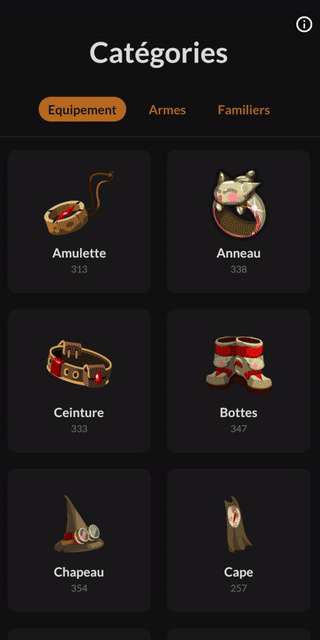

## Features
* All types of items are supported: equipments, weapons and pets
* Search items by name or scroll the list
* Item and set details view
* Discover a new item everyday (push notification)
* Dark theme
* I18n: French & English
* Works offline

## Screenshots

### Mobile

    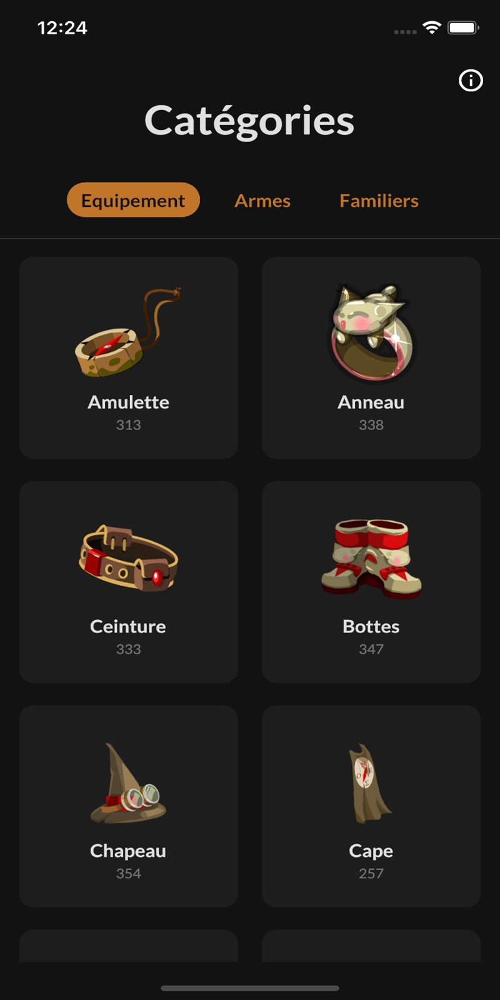
    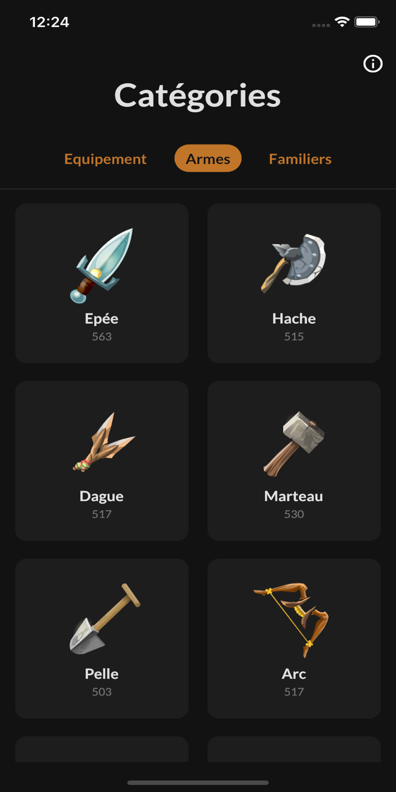
    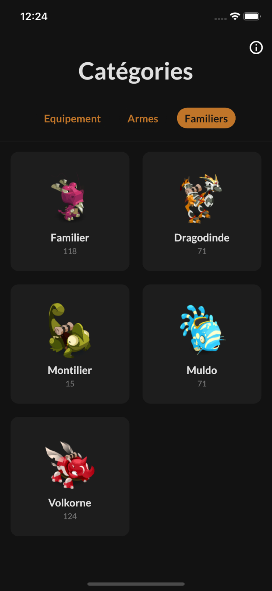
    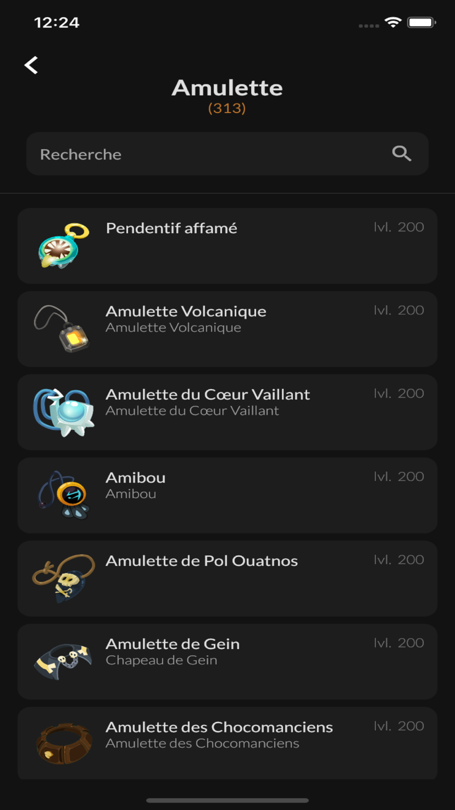

    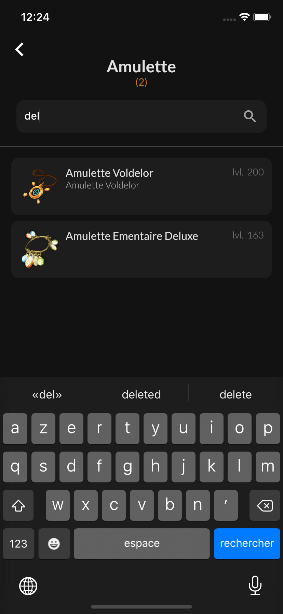
    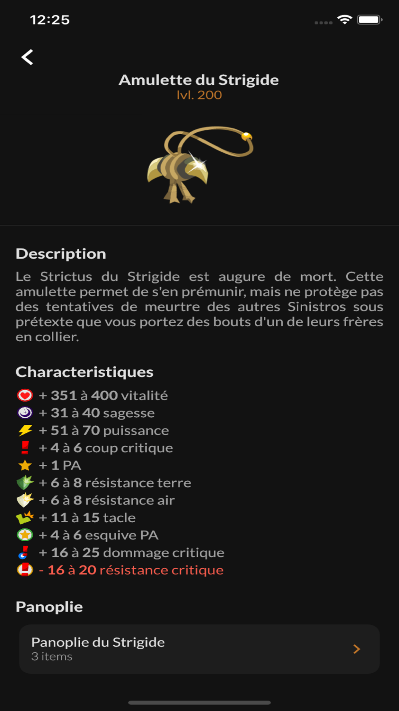
    

### Tablet

    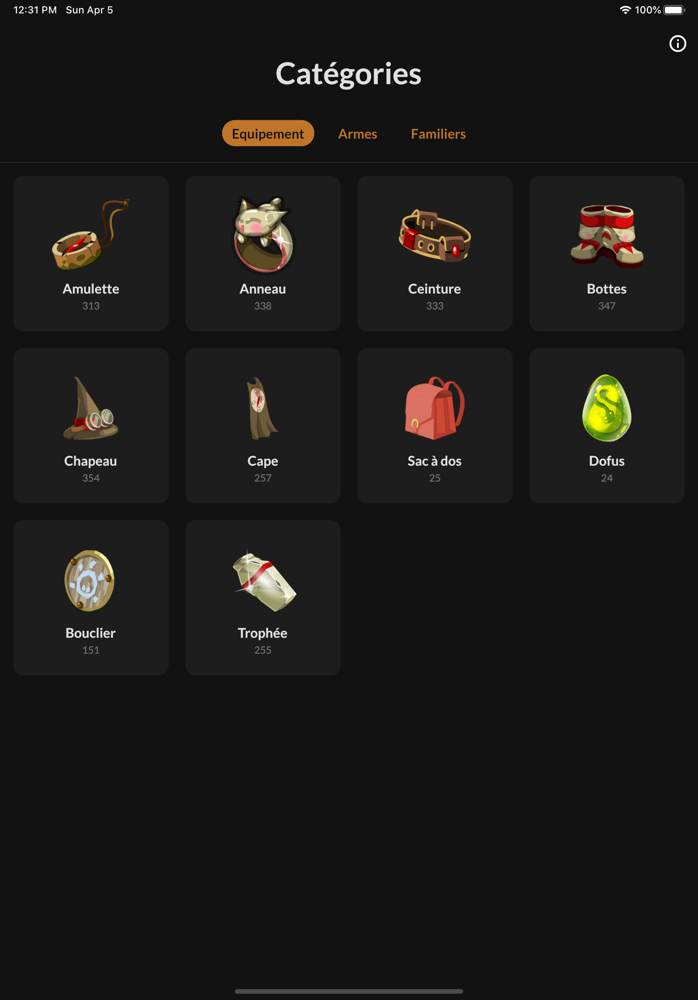
    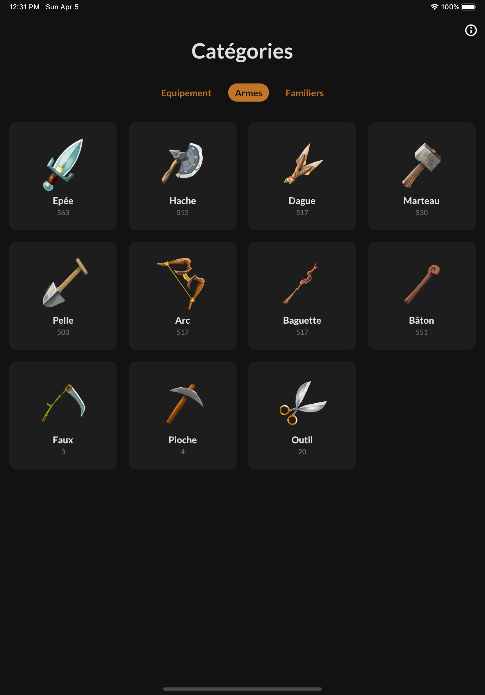
    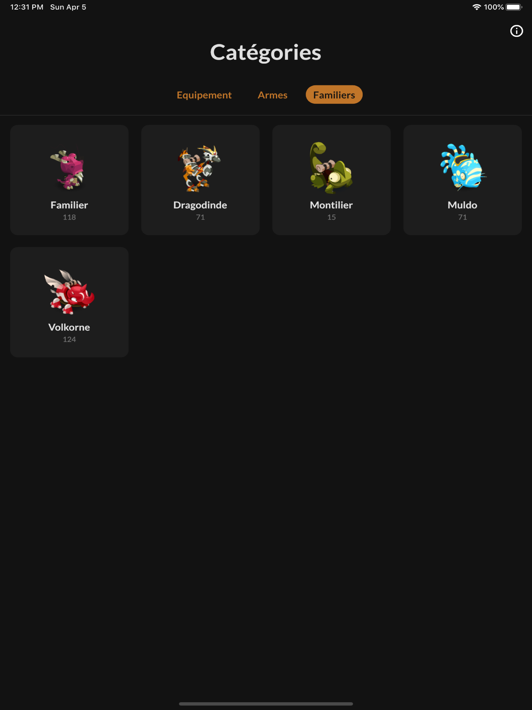

    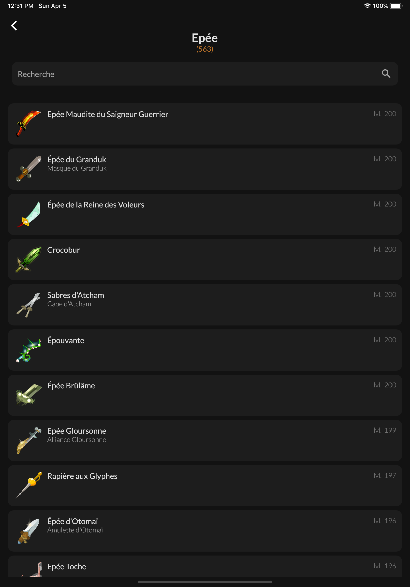
    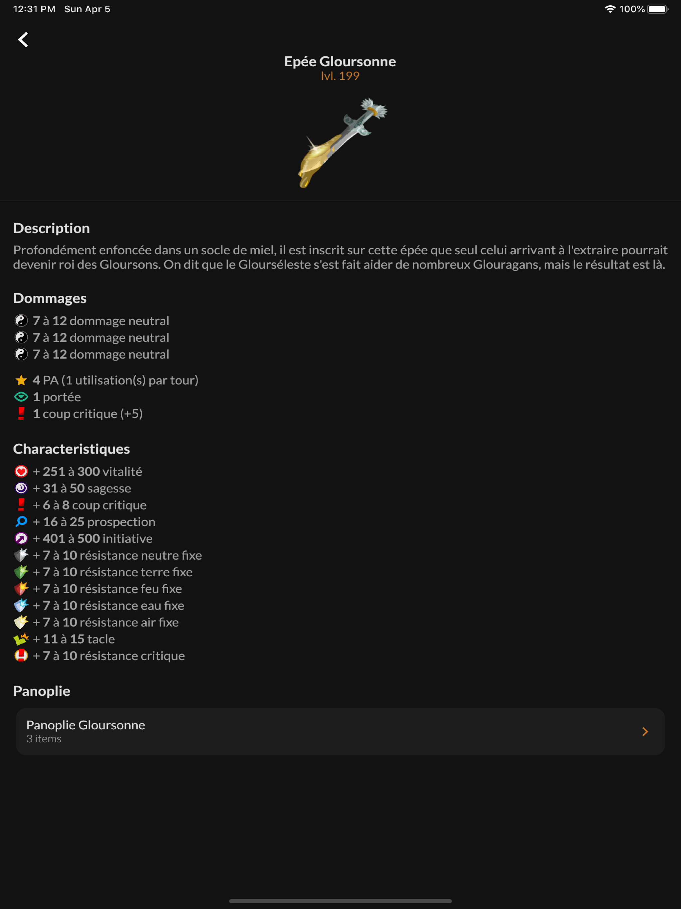
    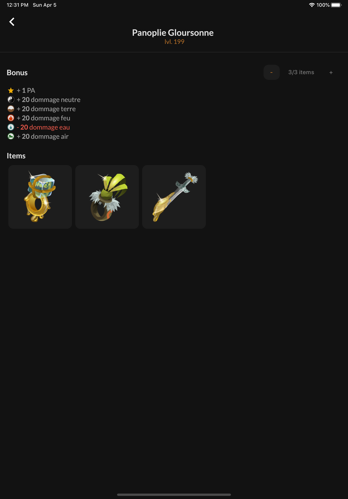

## Technical stack
* Flutter
* AWS Lambda
* Firebase Cloud Messaging

## Architecture

    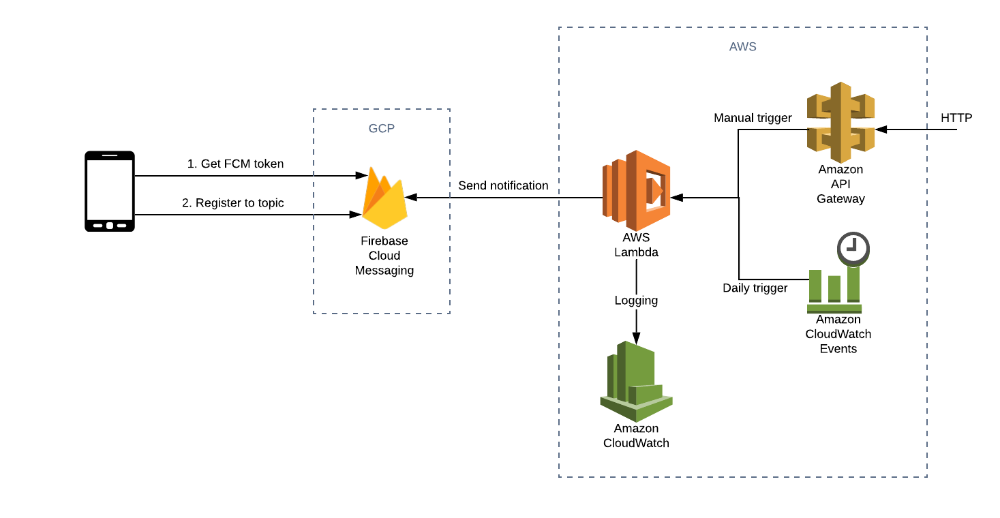

## Roadmap
* Add item/set conditions
* Add item recipe
* Support i18n plural
* Automate deployment with Codemagic CI/CD
* Fix data issue:
    - use the latest data
    - min/max range on wands
